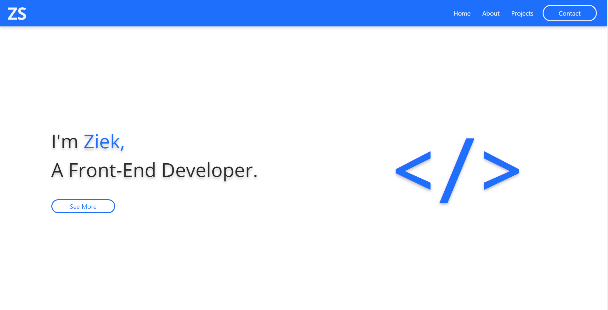

# Portfolio
My portfolio site!

 

### live site (https://app.netlify.com/sites/condescending-murdock-32ed57/overview)

# Table of Contents
1. [About](#whatitdoes)
2. [How it works](#howit)
3. [What I learned](#learned)

## About 
This is my portfolio site. It will serve as my hub for all my work and documentation of my journey in web development. As time goes on I hope to add new projects to it.

## How it works 
The site was built mainly with html and bootstrap. Some javascript and css is sprinked in to make some finsihing touches.

## What I learned 
- I haven't used bootstrap in a while, so this project helped to improve my knowledge of the framework.
